# Facebook-chatbot
## Mục tiêu
Xây dựng một chatbot hỗ trợ việc nghe nhạc, đọc thơ, kể chuyện cổ tích và hỏi đáp thông tin cá nhân

## Công nghệ sử dụng
Sinh viên sử dụng Rasa Framework, một thư viện mã nguồn mở hỗ trợ xây dựng chatbot để thực hiện project này.
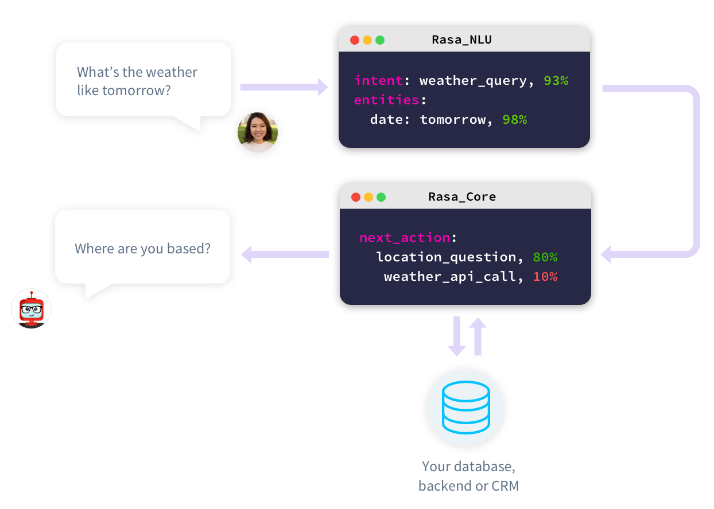
Thư viện mã nguồn mở Rasa là một nền tảng trí tuệ nhan tạo xử lý hội thoại theo ngữ cảnh (contextual conversations). 
Quản lý hội thoại nâng cao của Rasa dựa trên Machine Learning và cho phép các cuộc hội thoại thông minh hơn và giúp nhân rộng dễ dàng hơn. 
Rasa Là framework duy nhất cho phép Bot đối thoại tinh vi hơn, có tương tác, được train dựa trên supervised machine learning (học có giám sát).

Framework Rasa bao gồm:
* Rasa_NLU: công cụ giúp xử lý phân loại ý định (intent classification), thu thập phản hồi (respond retrieval) và bóc tách thực thể (entity extraction), nó sẽ giúp chatbot hiểu người dùng muốn gì và bắt được các thông tin chính trong đoạn hội thoại.
* Rasa_Core: công cụ giúp chatbot lựa chọn hành động/phản hồi lại người dùng. Nó dựa trên các kịch bản và lịch sử trò chuyện cùng các thuật toán Học máy để đưa ra phản hồi tốt nhất ứng với những thông tin đã bóc tách được nhờ NLU.
* Channels: công cụ kết nối chatbot với người dùng và với hệ thống backend

## Hướng dẫn cài đặt
Đầu tiên, ta cài đặt rasa về máy, phiên bản sử dụng ở project này là 1.7.0

`pip install rasa==1.7.0`

Sau đó di chuyển đến thư mục muốn khởi tạo Rasa và bắt đầu khởi tạo với dòng lệnh:

`rasa init`

Trong folder đó sẽ xuất hiện các file:
* data/nlu.md
* config.yml
* data/stories.md
* domain.yml
* action.py
* enpoints.yml
* credentials.yml

### File config.yml
Đây là nơi cấu hình cho NLU và cả Core, nơi chúng ta lựa chọn ngôn ngữ, model cần thiết.
```python
language: "en"

pipeline:
- name: "WhitespaceTokenizer"
- name: "RegexFeaturizer"
- name: "CRFEntityExtractor"
- name: "EntitySynonymMapper"
- name: "CountVectorsFeaturizer"
- name: "CountVectorsFeaturizer"
  analyzer: "char_wb"
  min_ngram: 1
  max_ngram: 5
- name: "EmbeddingIntentClassifier"
  batch_strategy: sequence
```
Vì ta xây dựng bộ dữ liệu từ vựng từ đầu nên việc sử dụng ngôn ngữ tiếng Anh (en) và tiếng Việt (vi) đều được. Pipeline là một quy trình hoàn chỉnh từ lựa chọn Tokenizer, Featurizer, Extractor đến Classiffer, giúp NLU bắt được các intent và entity từ hội thoại.
```python
policies:
  - name: MemoizationPolicy
  - name: KerasPolicy
  - name: MappingPolicy
  - name: FallbackPolicy
    nlu_threshold: 0.3
    core_threshold: 0.3
    fallback_action_name: "action_default_fallback"
```
Policies là các quy ước để Rasa_Core lựa chọn hành động tiếp theo dựa trên các entity và intent đã thu nhận được từ NLU. Chúng ta lần lượt khai báo cái Policy cần thiết. Ở đây, ta dùng một số policy như: MemoizationPolicy (quyết định message đầu ra dựa vào thông tin của những đoạn hội thoại trước đó), KerasPolicy (sử dụng mạng LSTM để tính xác suất đưa ra lựa chọn cho message tiếp theo), MappingPolicy(quyết định message dựa vào dữ liệu đã mapping) và trong trường hợp, việc tính xác suất đầu ra không thể vượt được ngưỡng mà FallbackPolicy đề ra, message trả ra sẽ là một action_default_fallback.

### File nlu.md
Đây là file data, gồm các câu nói của người dùng đã được gán nhãn intent và entity, dùng để train cho NLU. Data càng phong phú thì khả năng đáp ứng của chatbot càng cao.

### File domain.yml
Đây là nơi ta sẽ khai báo các thông tin đã có trong nlu.md, cụ thể:
* intent là các thông tin đã nếu trong file nlu, (có thể có cả entity),
* action là phần liệt kê các hành động, message đầu ra mà chúng ra định nghĩa.
* respone là phần chúng ta định nghĩa các message dạng text, hoặc hình ảnh, ... (các respone này thường có dạng utter_{})
* session_config là phần cấu hình cho một session như thời gian để restart lại một session, có mang slot từ session cũ sang session mới hay không, ...

### File stories.md
Đây là file chứa các kịch bản hội thoại cần thiết cho việc trò chuyện của bot. Việc dự tính trước các luồng hội thoại và xây dựng sẵn một kịch bản sẽ giúp con bot của chúng ta xử lí một cách trơn tru và thông minh hơn.

### File action.py và endpoint.yml
Đây là nơi viết các custom action như tìm kiếm nhạc, truyện, thơ... Ở mỗi class sẽ có name() là tên của action đã khai báo trong file domain.yml và stories và run() là hàm thực thi các hành động mong muốn.
Sau khi viết xong action.py, ta khai báo server thực hiện action ở endpoint.yml:
```python
action_endpoint:
  url: "https://lunachatbot-prj2-actions.herokuapp.com/webhook"
```
Sau khi đã hoàn thành mã nguồn, ta huấn luyện chatbot bằng dòng lệnh:
`rasa train`

## Deloy chatbot to Facebook

### Quản lý chứng thực của Rasa
Để có thể kết nối đến các nền tảng và deloy model đã train, ta cần khai báo các chứng chỉ vào file credentials.yml. Cụ thể ở đây ta khai báo các chứng chỉ để chứng thực với Facebook messenger:
```python
facebook:
  verify: "jackfrost"
  secret: "4ad8*********"
  page-access-token: "EAASm***********"
```
### Tạo file kết nối với facebook
Ta tạo file *facebook.py* để server thực thi có thể kết nối đến messenger bot mà ta sẽ tạo sau này

### Tạo các server ảo với Heroku
Ở Heroku, ta tạo 2 app là *lunathechatbot* để kết nối với facebook, lưu mô hình, thực hiện các thao tác cơ bản của bot và *lunathechatbot-actions* để thực thi các hành động khai báo trong file *actions.py*.

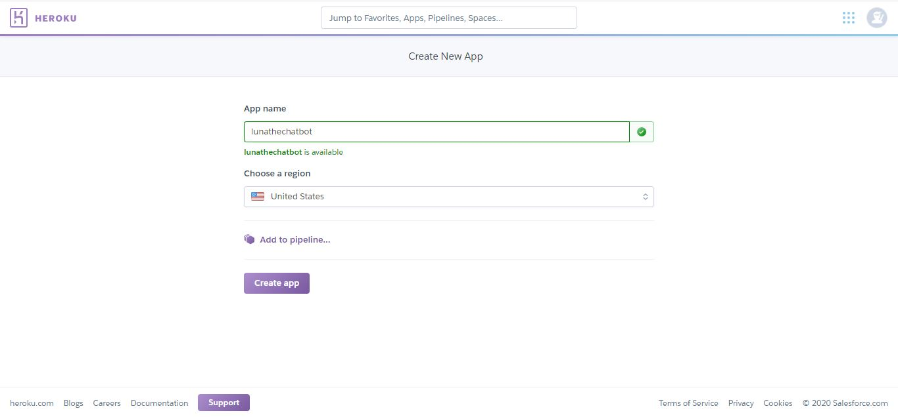
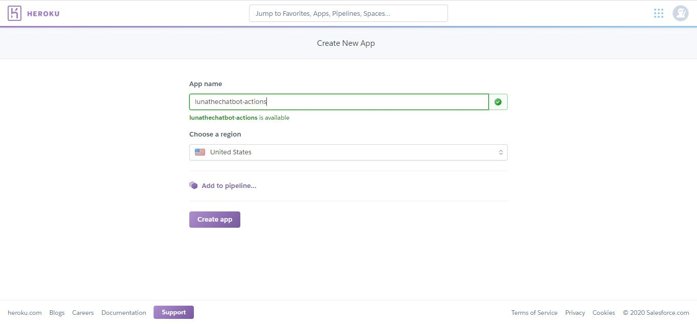

Tạo một folder mới với tên *actions_app* để đẩy các hành động lên cho server thực thi custom actions. Ta copy file *actions.py* vào thư mục này.

Tạo các file *Procfile* để khai báo các hành động cần thiết cho app heroku (*Procfile* của server nào thì nằm trong thư mục của server đó):

* Đối với *lunathechatbot*: `web: python facebook.py`
* Đối với *lunathechatbot-actions*: `web:  python -m rasa_sdk.endpoint --actions actions --port $PORT`

Tạo các file *requirements.txt* để thông báo các thư viện cần cài đặt cho app heroku (*requirements.txt* của server nào thì nằm trong thư mục của server đó).

Dùng cmd đẩy các mã nguồn lên server để server thực thi:

* Đối với *lunathechatbot*:
```python
$ git init
$ heroku git:remote -a <lunathechatbot>
$ heroku buildpacks:set heroku/python
$ heroku config:set PORT=5004
$ git add .
$ git commit -am "deploy my bot"
$ git push heroku master
```

* Đối với *lunathechatbot-actions*:
```python
$ git init
$ heroku git:remote -a <lunathechatbot-actions>
$ heroku buildpacks:set heroku/python
$ heroku config:set PORT=5055
$ git add .
$ git commit -am "deploy my bot"
$ git push heroku master
```

Lúc này việc set up các server đã xong, ta sẽ chuyển qua bước cuối cùng là tạo messenger bot.

### Tạo messenger bot với https://developers.facebook.com/
1. Truy cập https://developers.facebook.com/ và tạo một app mới
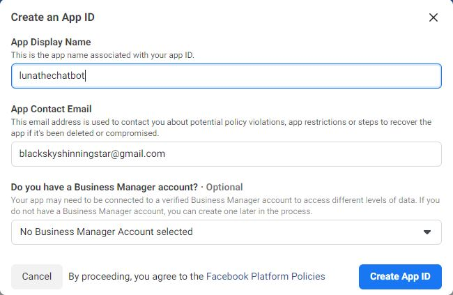
2. Vào *settings* -> *basic*, ấn nút *show* ở *App secret* để lấy khóa bí mật cho việc kết nối app, đây là *fb_secret* trong file *facebook.py*
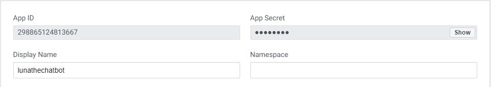
3. Vào *Dash board*, kéo xuống phần *Add product* và chọn *set up* ở Messenger
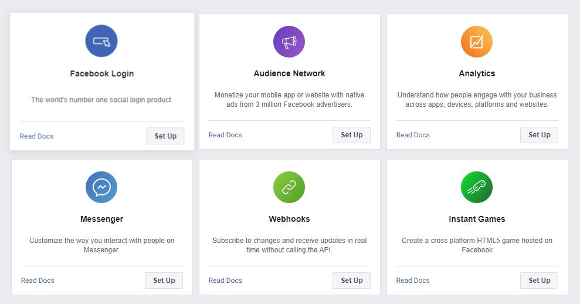
4. Kéo xuống phần *Access token* để kết nối messenger này với một trang facebook đã có hoặc tạo mới một trang với https://www.facebook.com/pages/creation/. *Page access token* chính là *fb_access_token* trong *facebook.py*
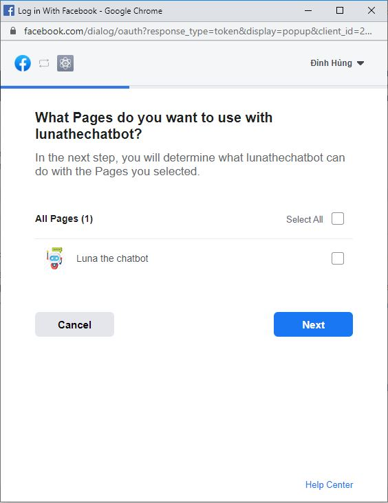
5. Ngay dưới phần *Access token* và *Webhook*, ta sẽ kết nối webhook đến url của server thực thi custom action là *lunathechatbot-actions*
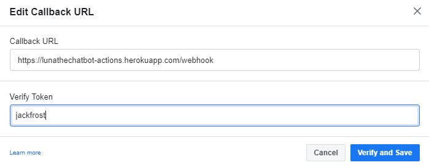
6. Cuối cùng, subscribe page để webhook phản hồi các event từ page đó
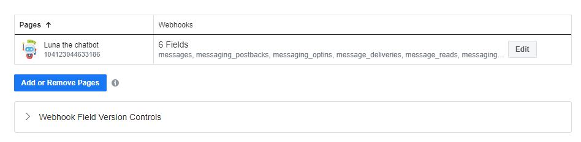
### Thử nghiệm chatbot hoàn thiện
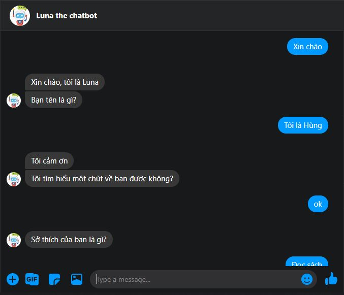
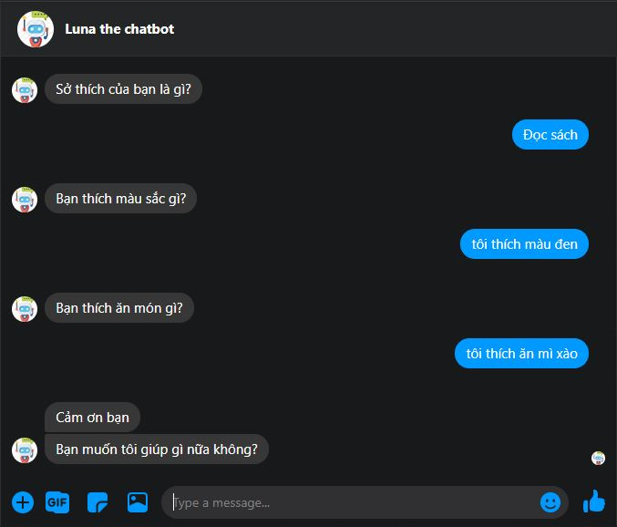
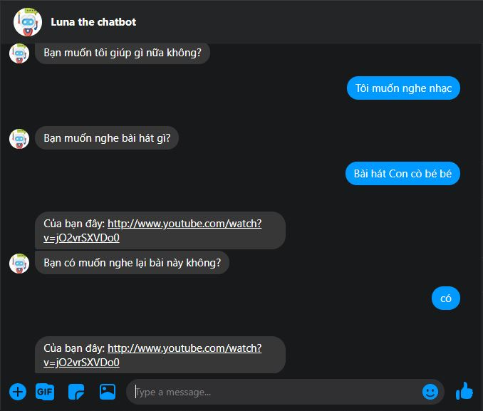
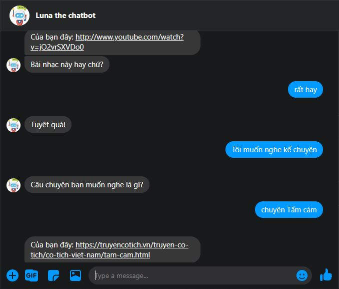
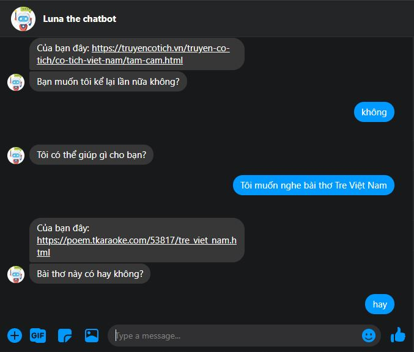
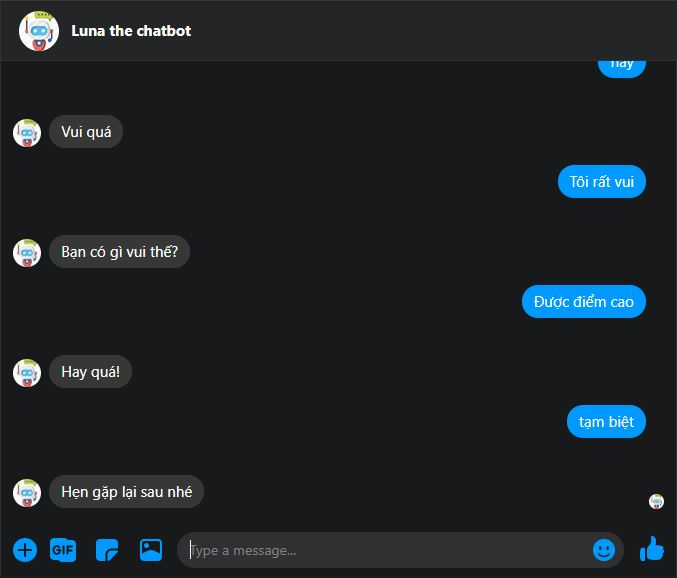
